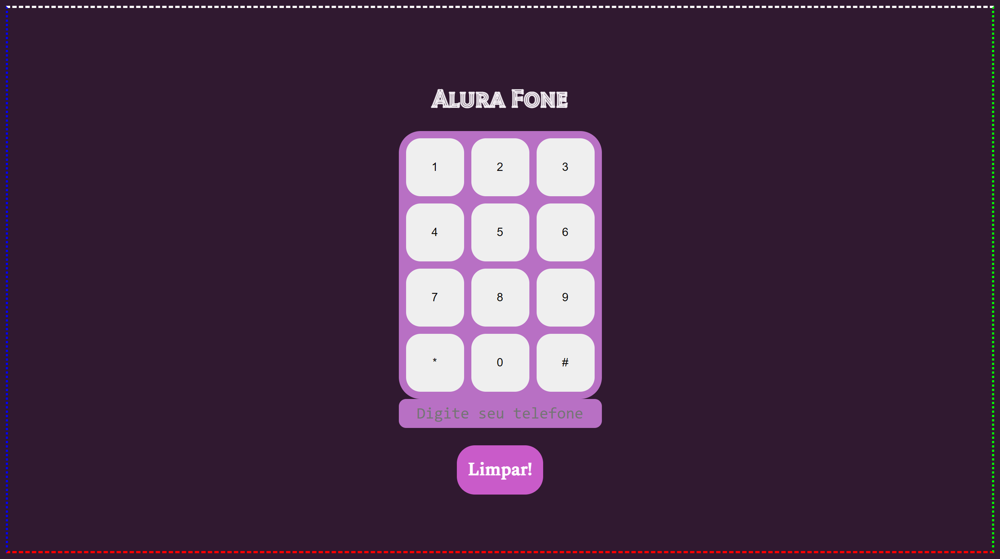
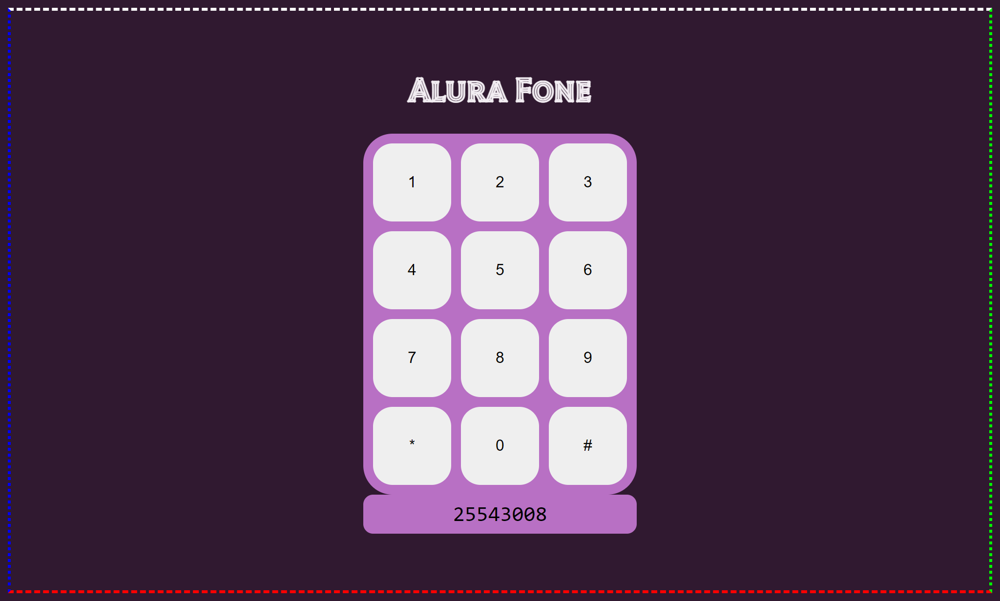
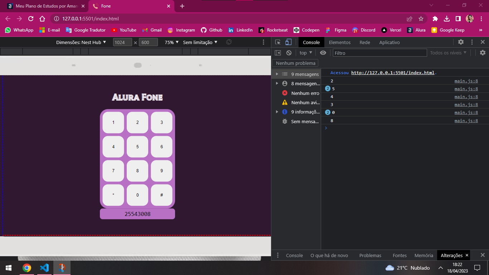

# Alura-Fone
É uma interface de telefone que quando discar um número, ele ficará gravado automaticamente no input e no console e para finalizar terá um evento de alerta disparará ao final do oitavo digito trazendo o valor.

 
<ul>
<li> Código em JavaScript.</li>
<li> Input do tipo telefone.</li>
<li>Clicar nos botões/dinâmicos. </li>
</ul>
 
 

 
 

 
 

